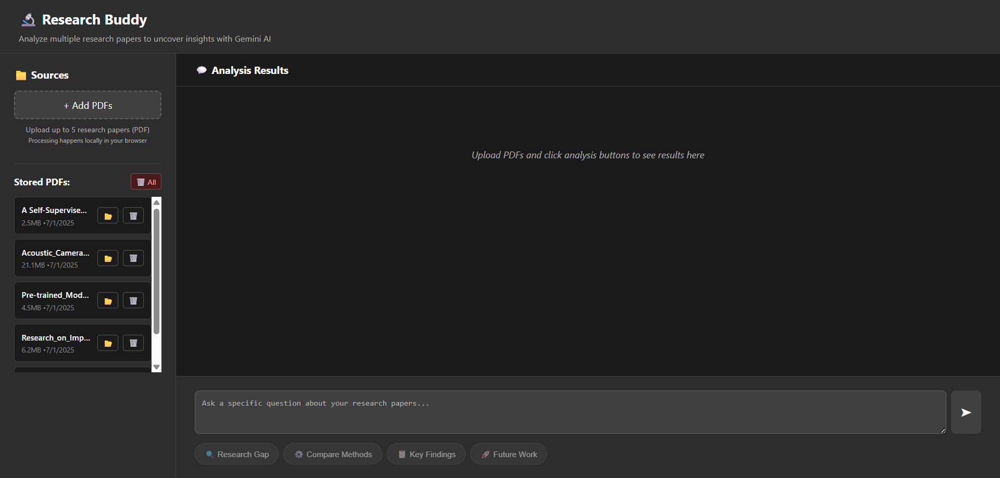
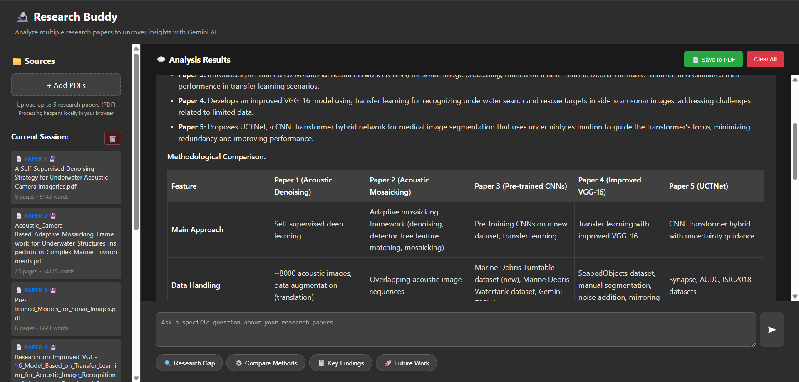

# 🔬 Research Buddy

A modern web application for analyzing research papers using Google Gemini AI. Research Buddy enables users to upload, process, and analyze multiple research papers directly in the browser, providing deep insights such as research gap analysis, methodology comparison, and more—all with a privacy-first, client-side processing approach.

---

## 🚀 Features

- **Client-Side PDF Processing:** Extracts text from PDFs in the browser using PDF.js, ensuring privacy and speed.
- **IndexedDB Storage:** Store and manage PDFs and extracted text locally for persistent, offline-friendly access.
- **Multiple Analysis Types:**
  - 🔍 Research Gap Analysis
  - ⚙️ Methodology Comparison
  - 📋 Key Findings Summary
  - 🚀 Future Work Suggestions
  - 💬 Custom Questions
- **Modern UI:**
  - Left sidebar for PDF upload, file management, and storage stats.
  - Right panel for analysis results, custom queries, and export options.
- **Export Results:** Save analysis results as PDF.
- **Backend AI Integration:** Uses Flask and Google Gemini API for advanced research analysis.
- **API Endpoints:** For file upload, analysis, and health checks.

---

## 🛠️ Technologies Used

### **Frontend**
- **React** (with Vite for fast development)
- **PDF.js** (`pdfjs-dist`) for client-side PDF parsing
- **IndexedDB** (via custom utilities) for local storage
- **jsPDF** for exporting results
- **React Markdown** for rich result rendering
- **ESLint** for code quality

### **Backend**
- **Flask** (Python) for REST API
- **Flask-CORS** for cross-origin support
- **PyMuPDF** for server-side PDF processing (legacy/compatibility)
- **Google Generative AI** (`google-generativeai`) for analysis
- **Werkzeug** for secure file handling
- **Gunicorn** for production deployment

---

## 🖼️ Screenshots

### Research Buddy Home


### Analysis Results Example


---

## ⚡ Quick Start

### **Backend Setup**

1. Navigate to the backend directory:
   ```bash
   cd backend
   ```
2. Create a virtual environment and activate it:
   ```bash
   python -m venv venv
   # On Windows:
   venv\Scripts\activate
   # On Mac/Linux:
   source venv/bin/activate
   ```
3. Install dependencies:
   ```bash
   pip install -r requirements.txt
   ```
4. Create a `.env` file with your Google API key:
   ```
   GOOGLE_API_KEY=your_gemini_api_key_here
   ```
5. Run the Flask server:
   ```bash
   python app.py
   ```
   The API will be available at `http://localhost:5000`

### **Frontend Setup**

1. Navigate to the frontend directory:
   ```bash
   cd frontend
   ```
2. Install dependencies:
   ```bash
   npm install
   ```
3. Start the development server:
   ```bash
   npm run dev
   ```
   The frontend will be available at `http://localhost:5173`
